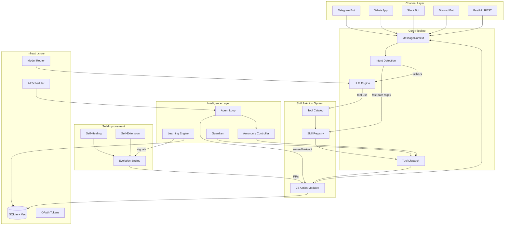
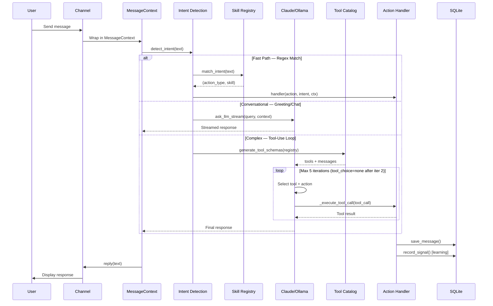
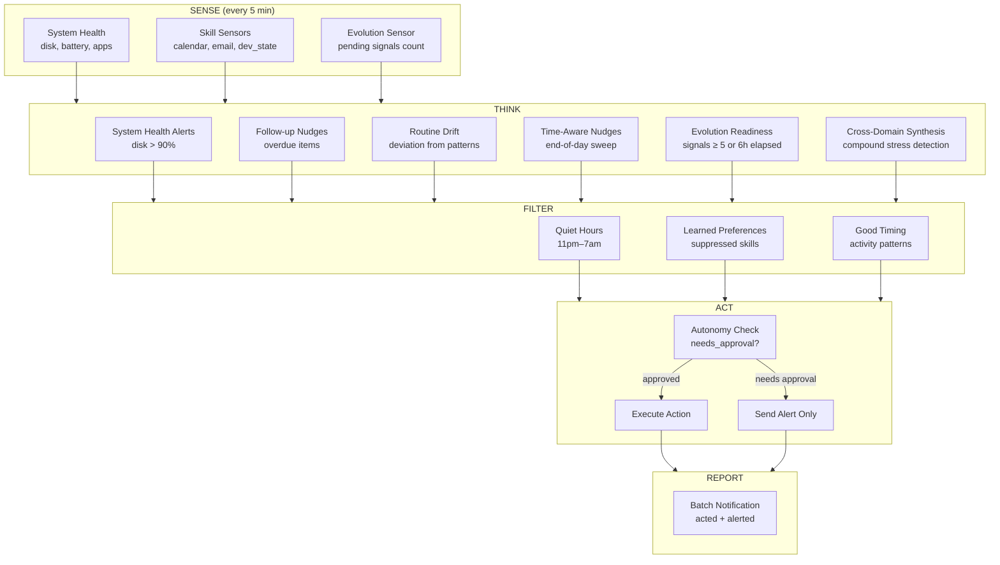
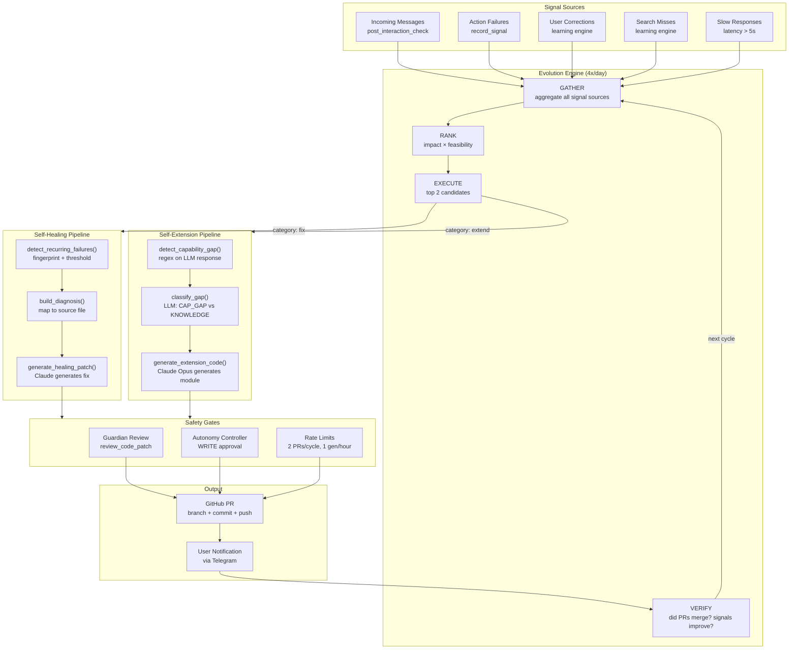
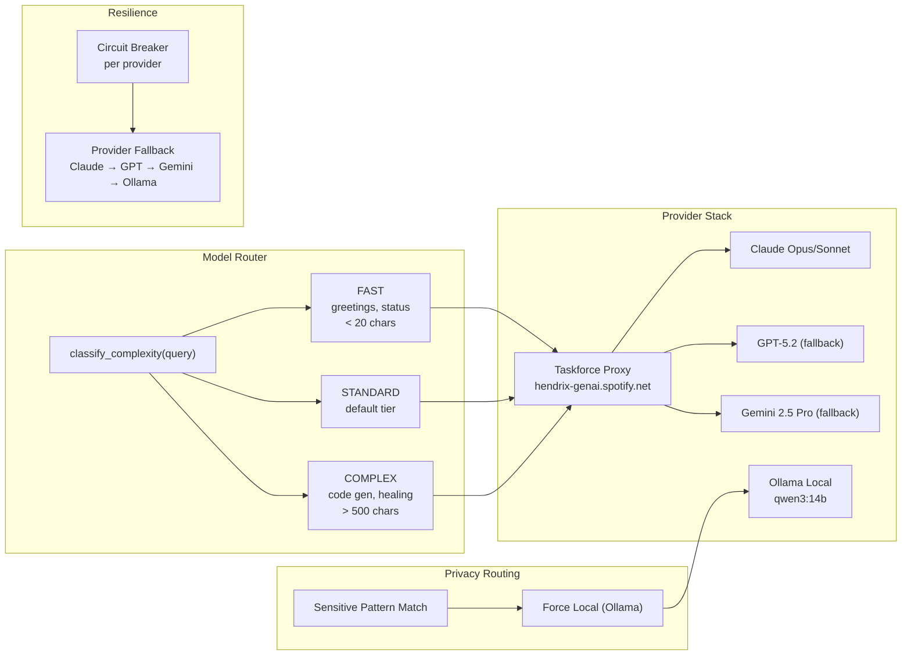
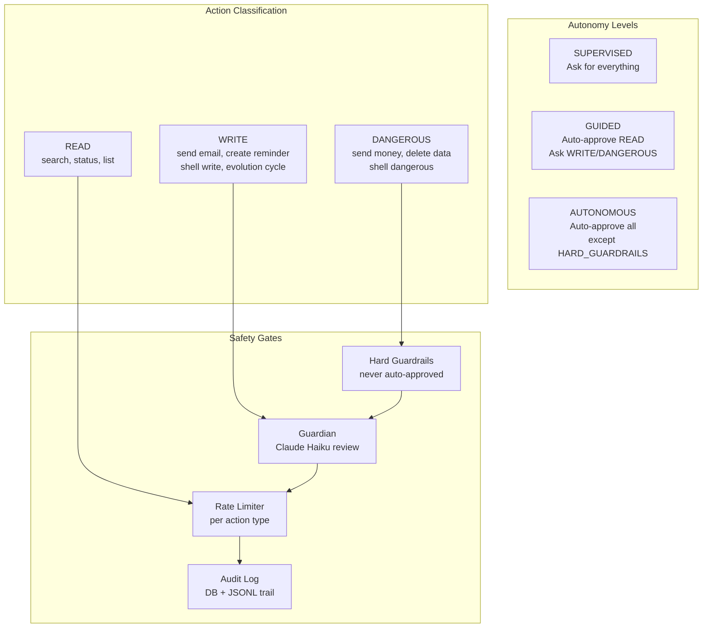
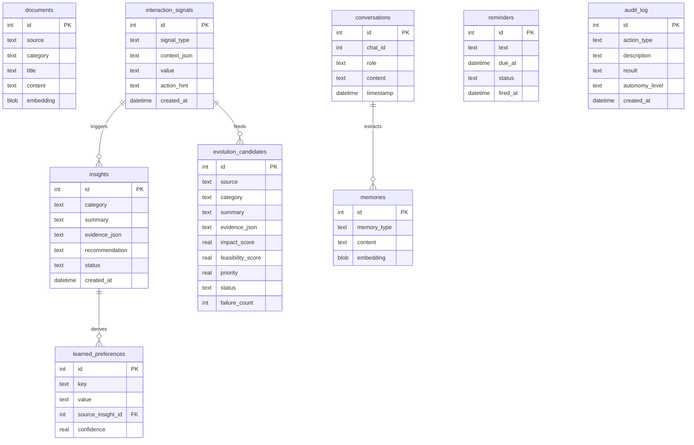
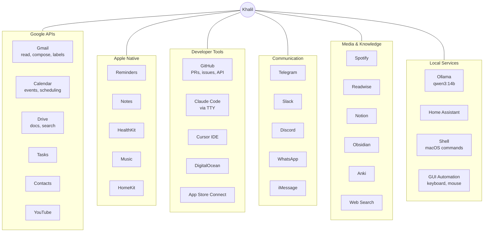

# Khalil — System Architecture

## High-Level Overview

## Message Processing Pipeline

## Skill & Action System

```mermaid
graph LR
    subgraph Discovery["Startup Discovery"]
        Scan["Scan actions/*.py<br/>for SKILL dicts"]
        ExtScan["Scan extensions/*.json<br/>for manifests"]
    end

    subgraph Registry["Skill Registry"]
        Match["match_intent(text)<br/>Regex patterns"]
        Handler["get_handler(action_type)<br/>→ callable"]
        Context["get_context_for_intent(text)<br/>→ selective LLM context"]
    end

    subgraph Catalog["Tool Catalog"]
        Filter["_INCLUDE_SKILLS<br/>~16 curated skills"]
        Schema["generate_tool_schemas()<br/>OpenAI format"]
    end

    subgraph ActionModules["Action Modules (73)"]
        direction TB
        A1["calendar, gmail, reminders"]
        A2["shell, terminal, tmux_control"]
        A3["spotify, weather, web"]
        A4["machine, dev_tools, gui_automation"]
        A5["github_api, slack_reader, drive"]
        A6["workflows, pomodoro, synthesis"]
        A7["apple_reminders, apple_notes, apple_health"]
        A8["extend, guardian, healing"]
    end

    Scan --> Registry
    ExtScan --> Registry
    Registry --> Catalog
    Match --> Handler
    Handler --> ActionModules
    Filter --> Schema
    Schema -->|"~120 action types<br/>across ~16 tools"| LLM["LLM Tool-Use"]
```

## Agent Loop — Sense/Think/Act Cycle

## Self-Improvement Architecture

## LLM & Model Layer

## Autonomy & Safety

## Data Layer

## Scheduled Jobs

```mermaid
gantt
    title Daily Schedule (Recurring Jobs)
    dateFormat HH:mm
    axisFormat %H:%M

    section Evolution
    Evolution Cycle     :03:00, 30min
    Evolution Cycle     :09:00, 30min
    Evolution Cycle     :15:00, 30min
    Evolution Cycle     :21:00, 30min

    section Agent Loop
    Sense/Think/Act     :00:00, 1440min

    section Digests
    Morning Brief       :08:00, 15min
    Financial Check     :12:00, 10min

    section Weekly (Monday)
    Career Alert        :18:00, 10min
    Weekly Summary      :18:30, 15min

    section Weekly (Friday)
    Friday Reflection   :17:00, 15min

    section Continuous
    Reminder Check      :00:00, 1440min
    Dev State Poll      :00:00, 1440min
    Email Sync          :00:00, 1440min
    Meeting Prep/Follow :00:00, 1440min
```

## External Integrations

