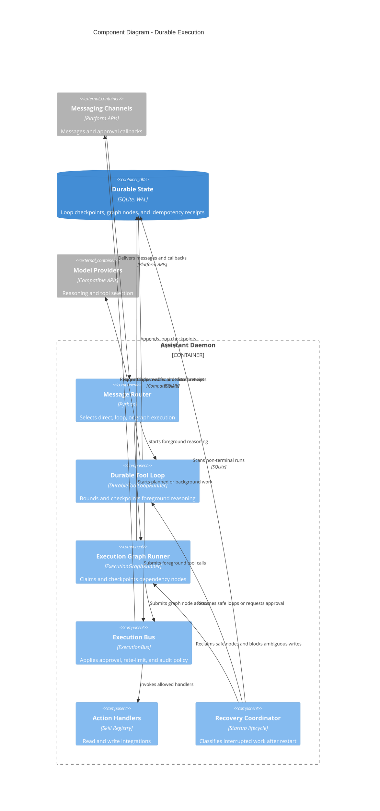

# Khalil execution components

Foreground conversations use a bounded durable loop. Planned, workflow, scheduled, and proactive work use durable dependency graphs. Both paths cross the same execution-policy boundary before an action handler runs.

