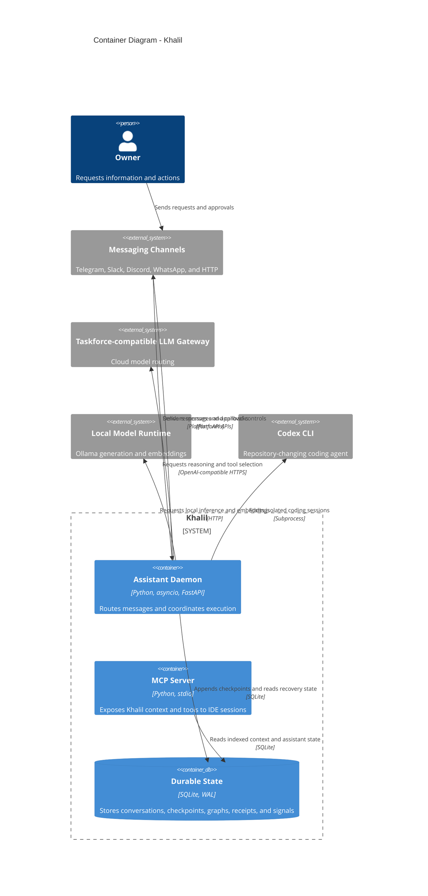

# Khalil containers

The Python daemon owns message handling and execution coordination. SQLite is the durable source of truth for both foreground loops and multi-step graphs; model providers and Codex remain external runtimes.

