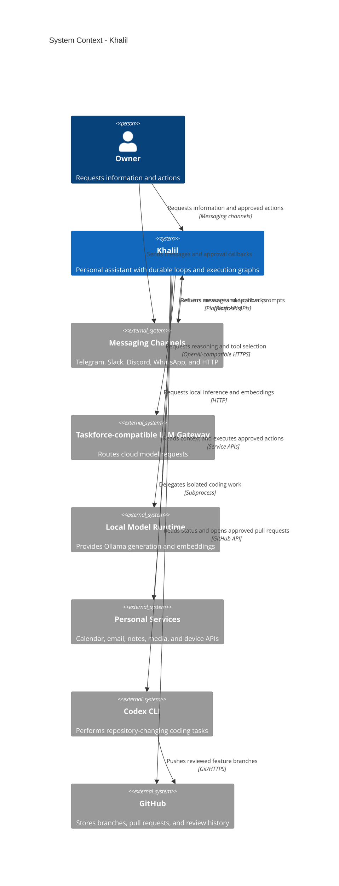

# Khalil system context

Khalil is a personal assistant that accepts messages, gathers context, executes approved actions, delegates repository work to Codex, and preserves execution state across restarts.

