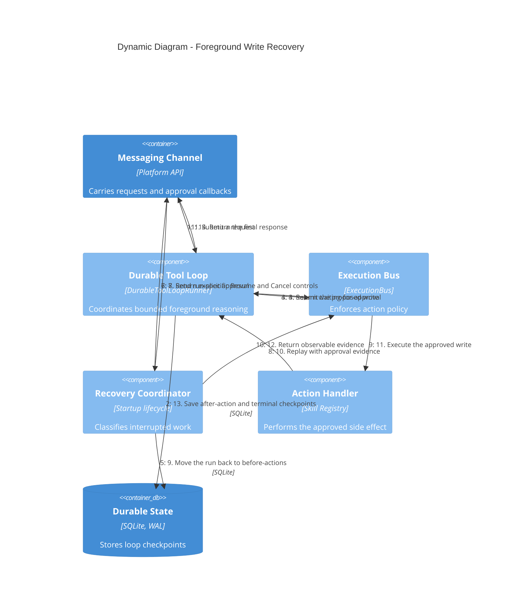

# Khalil restart recovery flow

This flow shows a foreground write that reaches the shared execution policy, pauses durably, survives a process restart, and continues only after explicit approval.

